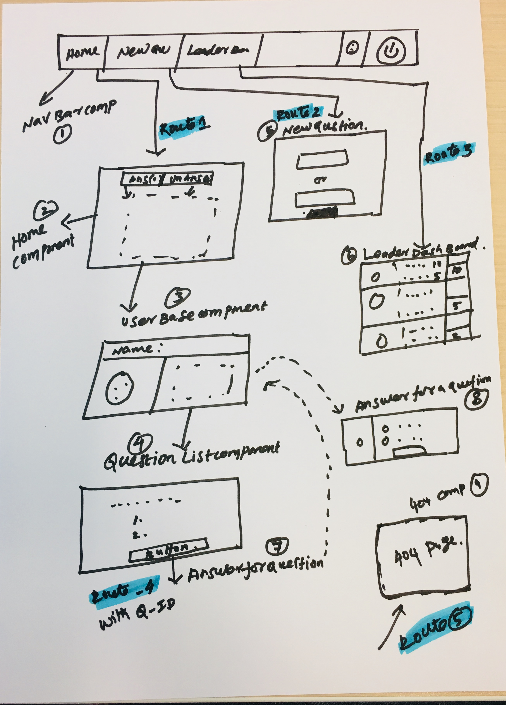

## Installation

Clone the repository,and use NPM to install the project dependencies.

- `npm install`

## To start the application

- `npm start`

This automatically opens the below URL with app running

- [http://localhost:3000](http://localhost:3000)

### Project Plan

## App Functionality

## Login and landing page

- The person using this application will have a way of logging in as an existing user,By selecting the user name in a drop down.
- The application works regardless of which evenr user is selected. 
- Once the user logs in, the home page will be shown with logged in user in the navigation bar.
- When user entering the address in the address bar, the user will asked to sign in agaiin and will land on the requested page.
- For a logged in user the application allows log out and take him/her to default login page.

## List of questions page/Home page

- Once the user logs in, the user will be able to toggle between his/her answered and unanswered questions on the home page (Technically root page) 
- The question in both categories are arranged from the most recently created (top) to the least recently created (bottom). 
- And the unanswered questions tab will be shown by default

## Question details & result page

- Selcting each question will take user to details of that question ,which will be available at questions/:question_id.
- Based on the question category it will show up either result or vote for the question in the same route above

# Answering for a question page
  Thig page contains

- Text “Would You Rather”;
- Avatar of the user who posted the question
- Two options with radio button
- And submit the answer which takes to result page (described below)
- The Same question will appear in the “Answered” Tab with updated count

## Result page 
- This page will have 2 entries 
1. directly from answerd segment 
2. After submitting the answer for a question

This page contains

- Text “Result”;
- Avatar of the user who posted the question
- Text of the options
- Number of people who voted for each option
- And a bar with percentage of people who voted for that option
- An icon which represents the option selected by the logged-in user

## Leader's dashboard 

- This page will be available at /leaderboard route.

 This page contains
- User’s name;
- User’s Avatar;
- Number of questions they asked 
- Number of questions they answered
- User will ordered in descending order based on the sum of the number of questions they’ve asked and the number of questions they’ve answered

### Create new question Page

- This page will be available at /add route.

This from contains
- Text “Would You Rather” 
- Text field to creating two options. 
- Submit button 
- Upon submitting the form, a new question will be created
- the user should be taken to the home page
- The new  question will appear in the unanswered tab.

## Depplinked routes
- When ever user tries to typing the below address into the address bar they should as for sigin and the land on the specific page
1. /add 
2. /leaderboard
3. questions/:Valid id.

It would be no fun to vote in polls if we couldn’t post our own questions! The form for posting new polling questions should be available at the /add route. The application should show the text “Would You Rather” and have a form for creating two options. Upon submitting the form, a new poll should be created, the user should be taken to the home page, and the new polling question should appear in the correct category on the home page.

## 404 Page
 To Avoid errors on the screen/to have a better user exprience in below 
 in this page navigation bar is always displayed ,so that the user can easily navigate anywhere in the application.

 - If the user is trying to access a poll that does not exist. 
 - Any other invalid URL accessed from browser

